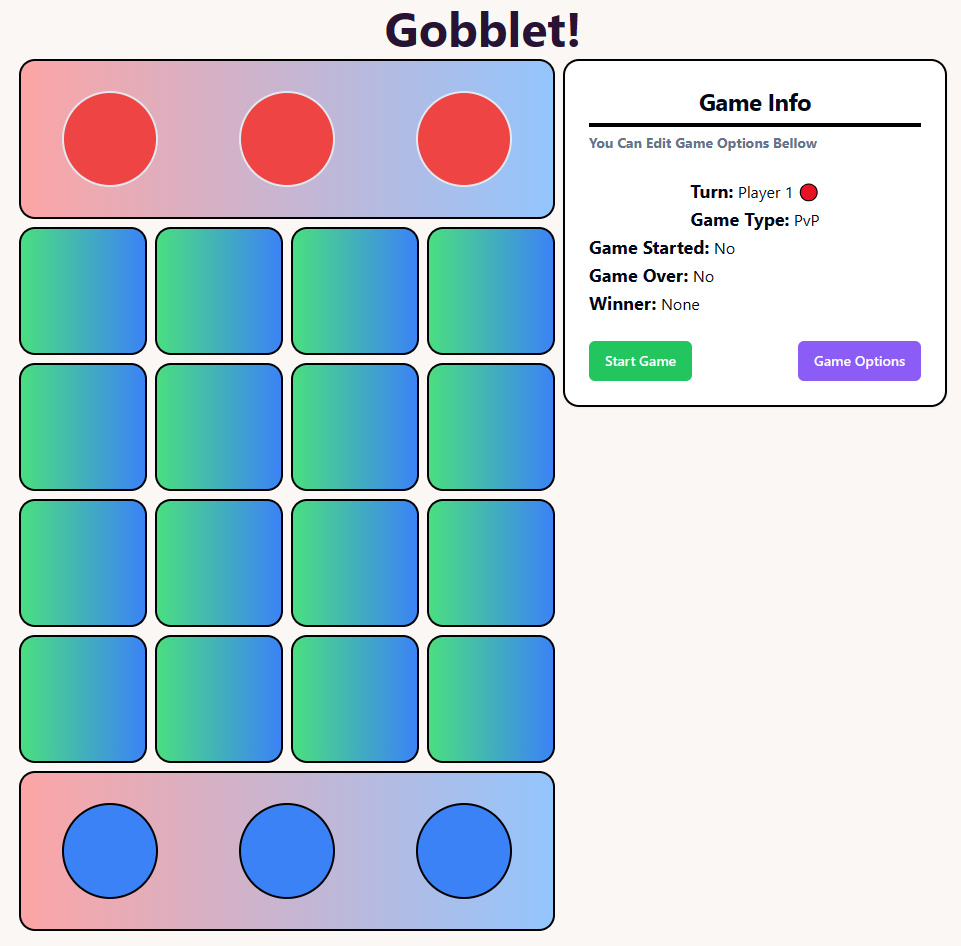
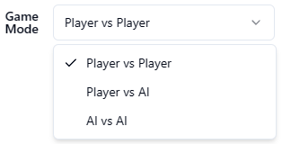
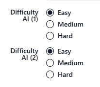
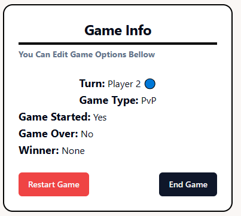
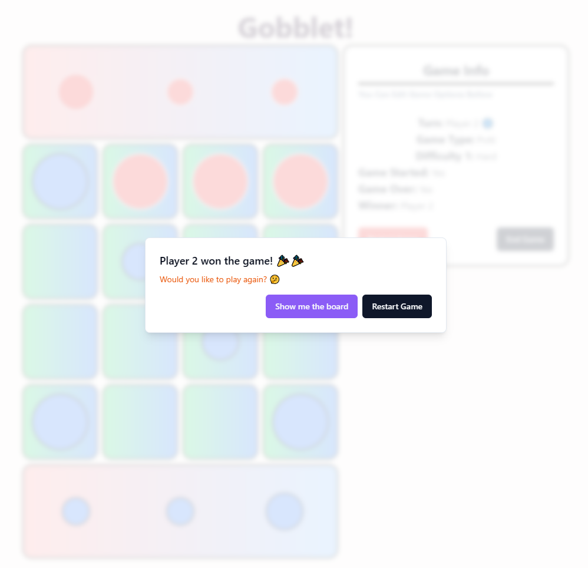
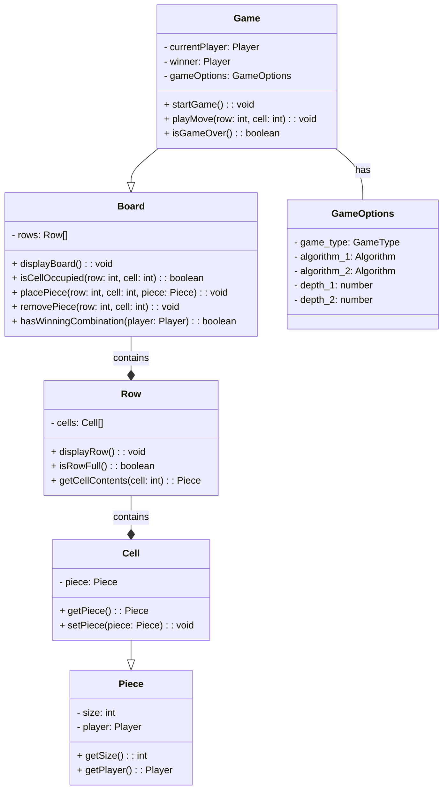
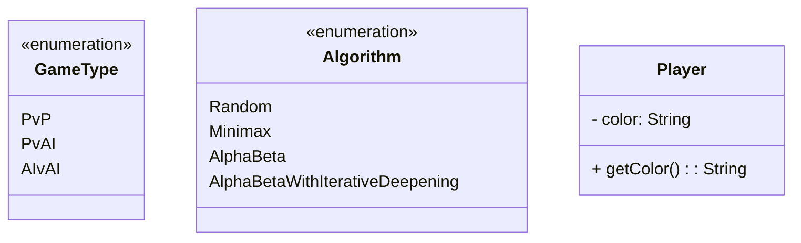
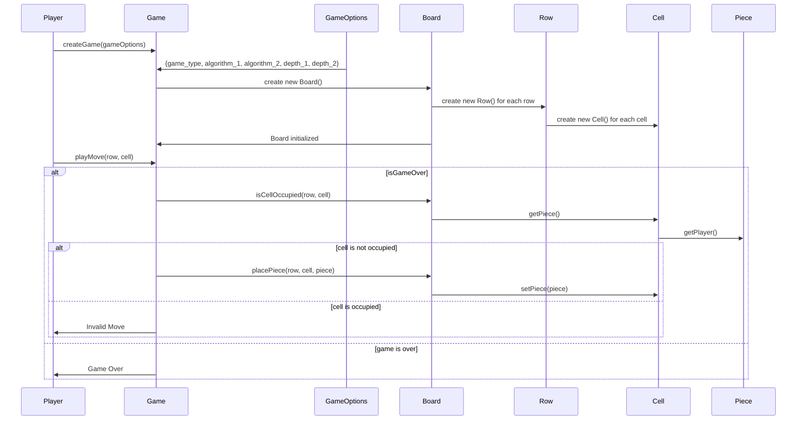
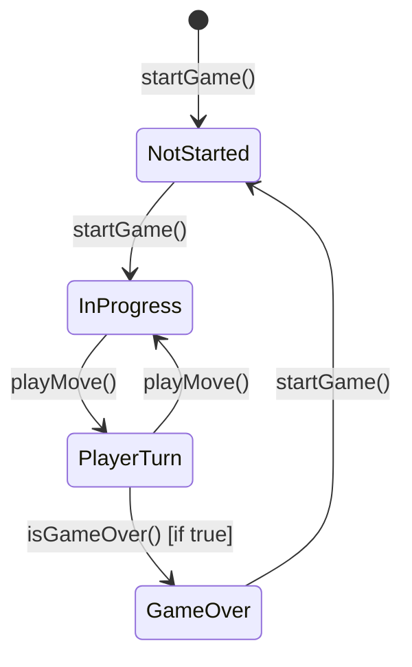

# Gobblet!

## Description

Gobblet is a two-player board game. The objective of the game is to place four gobblets of the same size in a row, column, or diagonal. The game is played on a 4x4 board. Each player has 12 gobblets, which are of four different sizes. The sizes are 1, 2, 3 and 4. The larger gobblets can cover the smaller ones. The game starts with each player having 12 gobblets of size 1, 2, and 3. The players take turns placing one gobblet on the board. The gobblets can be placed on any empty square or on top of any gobblet that is already on the board. The game ends when one player has four gobblets in a row, column, or diagonal. The player with four in a row wins the game.

## How to run

### Visit live app! : https://gobblet.vercel.app/

To run the game, run the following command in the terminal:

```bash
npm install
npm run dev
```

or run the executable.

## Project features

### 1. Main UI



Click the "Start" button to start the game. Click the "Game Options" button to change the game options.

### 2. Game options

#### 2.1. Game modes



#### 2.2. Game difficulty




### 3. Game Info Menu

It shows current game status.



### 4. Winnig Dialog




## Class Diagram






### Sequence Diagram



### State Diagram
